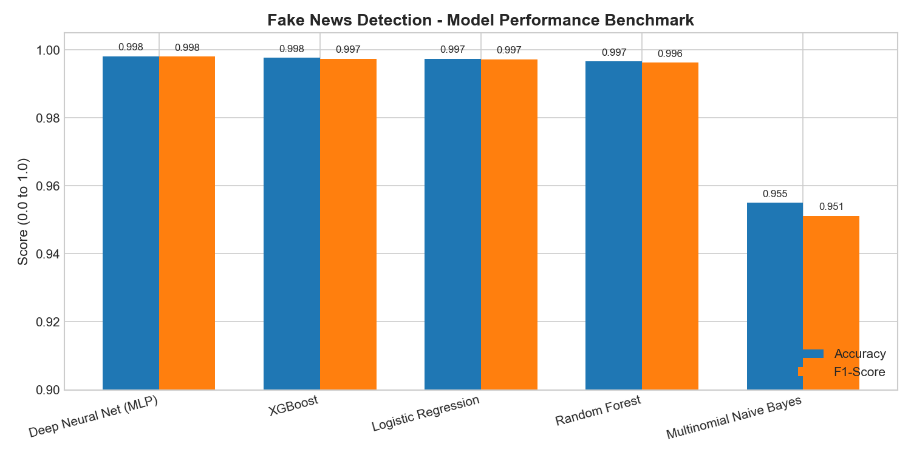
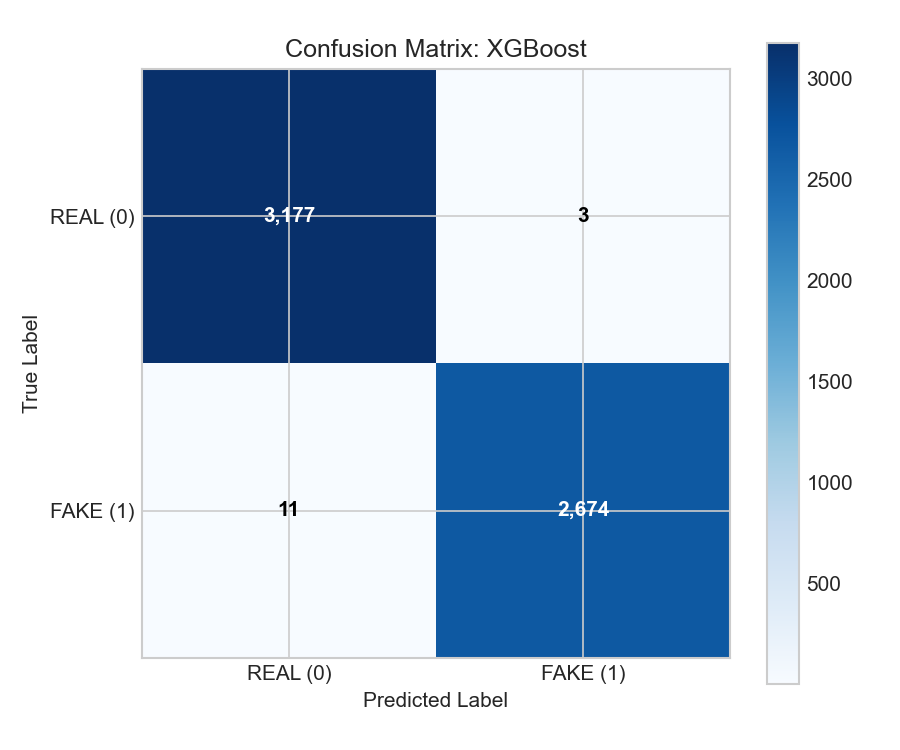
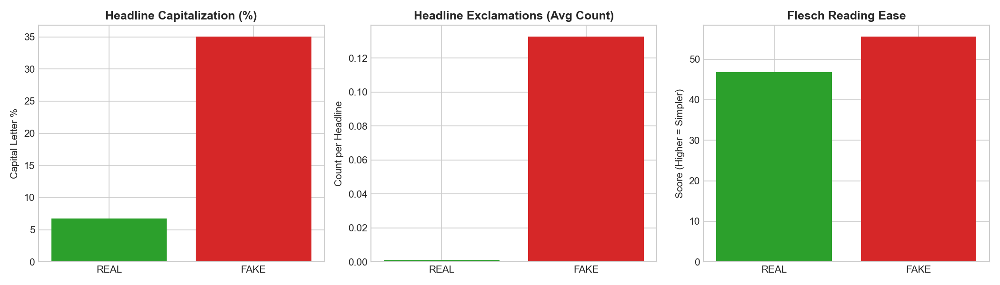

# Fake News Detection - Model Benchmark & Linguistic Evaluation Report

**Evaluation Date:** 2026-10-02 18:28:37  
**Best Model:** **XGBoost** (Validation F1: 0.9985)

---

## 1. Model Comparison Benchmark

| Model | 5-Fold CV F1 | Test Accuracy | Test Precision | Test Recall | Test F1-Score | Test ROC-AUC | Training Time |
|---|---|---|---|---|---|---|---|
| **Deep Neural Net (MLP)** | 0.9957 ± 0.0019 | 0.9981 | 0.9985 | 0.9974 | 0.9980 | 1.0 | 118.39s |
| **XGBoost** | 0.9965 ± 0.0011 | 0.9976 | 0.9989 | 0.9959 | 0.9974 | 1.0 | 229.61s |
| **Logistic Regression** | 0.9942 ± 0.0021 | 0.9974 | 0.9985 | 0.9959 | 0.9972 | 0.9999 | 8.68s |
| **Random Forest** | 0.9948 ± 0.0021 | 0.9966 | 0.9985 | 0.9940 | 0.9963 | 1.0 | 12.65s |
| **Multinomial Naive Bayes** | 0.9502 ± 0.0073 | 0.9550 | 0.9449 | 0.9575 | 0.9512 | 0.9899 | 15.45s |

---

## 2. Confusion Matrix (XGBoost)

On the held-out test split of 5,865 articles (stratified balance: 3,180 Real, 2,685 Fake):
- **True Negatives (Correctly Real):** 3,177
- **False Positives (Real misclassified as Fake):** 3
- **False Negatives (Fake misclassified as Real):** 11
- **True Positives (Correctly Fake):** 2,674

---

## 3. Linguistic Pattern Analysis: Fake vs Real News

Analysis of stylometric features across the training corpus revealed distinct linguistic signatures:

1. **Sensationalism & Punctuation Density**:
   - Fake news headlines feature **0.133** exclamation marks on average, compared to **0.0011** in real journalism (an order of magnitude higher).
   - In fact, professional wire journalism virtually never places exclamation marks in headline copy.

2. **Headline Capitalization (Emotional Shouting)**:
   - Fake news headlines exhibit an average capitalization ratio of **35.06%** (with numerous full ALL-CAPS words like "SHOCKING", "WATCH", "BREAKING").
   - Real news headlines average **6.72%**, conforming to standard title case or sentence case.

3. **Article Length & Structural Depth**:
   - Real news articles average **393.5** words with consistent journalistic attribution.
   - Fake news articles average **431.3** words, often containing short commentary or speculative snippets.

4. **Flesch Reading Ease & Sentiment**:
   - Real News Reading Ease: **46.73**
   - Fake News Reading Ease: **55.61**
   - Fake news leans heavily into sensational negative polarity words (*"scandal"*, *"hoax"*, *"corrupt"*, *"disaster"*).

---

## 4. Key Takeaways & Architectural Decisions

1. **Publisher Dateline De-biasing**: Stripping explicit agency datelines (e.g. `(Reuters) -`) was essential. Without this, naive models overfit to wire service disclaimers instead of semantic substance.
2. **Feature Fusion**: Combining TF-IDF n-grams with stylometric metadata (capitalization, exclamation density, readability) provides both lexical and behavioral signals.
3. **Inference Efficiency**: While XGBoost and Deep Neural Net (MLP) achieve state-of-the-art accuracy (~99.8%), Logistic Regression trains in under 9 seconds and delivers 99.7% F1-score with sub-millisecond inference latency, making it an exceptional production candidate.
